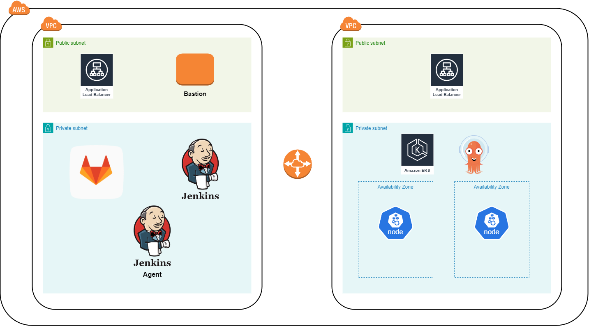
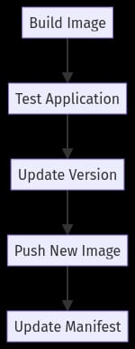
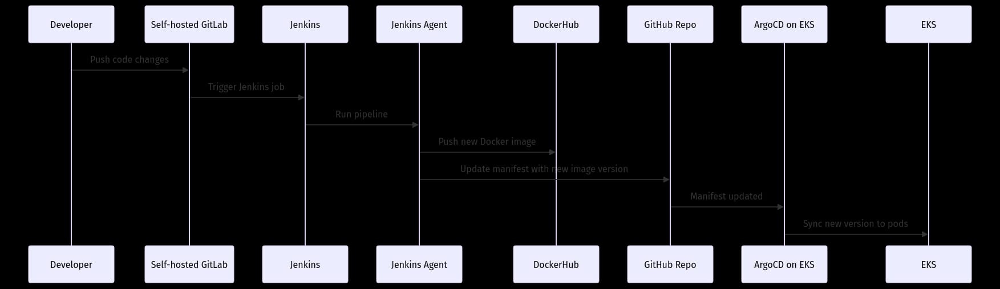

 

  <h1 align="center">Jenkins CI/CD Pipeline</h1>

<!-- ABOUT THE PROJECT -->

## About The Project

The Weather App project delivers real-time weather updates through a user-friendly web interface. Utilizing modern tools like Docker, Kubernetes, and GitLab CI/CD pipelines, it optimizes development, testing, and deployment for a smooth experience for developers and users alike. With automated versioning, continuous integration, and deployment to Amazon EKS, the app ensures high reliability, scalability, and performance. GitHub manages version control, while Docker Hub distributes container images, promoting collaboration and simplifying deployment. All infrastructure is managed with Terraform, offering efficiency, precision, and accessibility for both developers and users seeking accurate weather forecasts.

### Built With

- ![Linux][Linux]
- ![Git][Git]
- ![Python][Python]
- ![Docker][Docker]
- ![Jenkins][Jenkins]
- ![Kubernetes][Kubernetes]
- ![AWS][AWS]
- ![Terraform][Terraform]

### Architecture

  

1. **VPC**:
   - Two VPCs, each with **public** and **private subnets**. Both VPCs are connected via a network link (VPC peering).

2. **Public Subnet**:
   - **Application Load Balancers (ALB)** are deployed in the public subnets of both VPCs. These will handle traffic from external sources and distribute it to the appropriate services.
   - In one public subnet, a **Bastion Host** is deployed, allowing secure SSH access to instances inside the private subnets.

3. **Private Subnet (CI/CD Infrastructure)**:
   - **Jenkins**: A Jenkins master is deployed in one private subnet, responsible for orchestrating the CI/CD pipeline.
   - **Jenkins Agent**: A Jenkins worker (agent) is also present, assisting the Jenkins master in executing jobs.
   - **GitLab**: The source code management tool is deployed in the same private subnet, acting as the version control system for the project.

4. **Private Subnet (EKS Cluster)**:
   - **Amazon EKS**: The Amazon Elastic Kubernetes Service (EKS) is deployed in the private subnet of the second VPC.
   - **Octopus Deploy**: A deployment automation tool is shown in the same subnet, likely handling the deployment process into EKS.
   - **EKS Nodes**: Two availability zones are displayed, each with EKS worker nodes. These nodes will run the containers managed by the EKS control plane.

5. **Network Flow**:
   - The **Application Load Balancers** direct traffic, likely towards the services running within the EKS nodes.
   - Jenkins and its agent are used for CI/CD, while GitLab manages the source code. Octopus Deploy automates the deployment processes, pushing to EKS nodes in different availability zones.

This architecture supports a fully integrated DevOps environment, leveraging Jenkins for CI/CD, GitLab for version control, and Amazon EKS for scalable container orchestration, all with a secure, VPC-separated infrastructure on AWS.

## Pipeline Stages

  

$`\textcolor{green}{\text{3. Build}}`$: Builds the Docker image for the Weather App.

$`\textcolor{green}{\text{4. Test}}`$: Runs tests on the Dockerized Weather App to ensure its functionality.

$`\textcolor{green}{\text{2. Versioning}}`$: Determines the new version based on the branch being merged and updates the manifest file in a GitHub repository.

$`\textcolor{green}{\text{5. Publish}}`$: Tags the Docker image with the appropriate version and publishes it to Docker Hub.

$`\textcolor{green}{\text{6. Deploy to EKS}}`$: Updates the Kubernetes configuration with the latest Docker image tag and applies the changes to the Amazon EKS cluster using ArgoCD.

$`\textcolor{green}{\text{7. Cleanup}}`$: Removes the Docker image from the local Docker registry to free up space.

<!-- Pipeline Flow Section -->
## Pipeline Flow
  

  

  The pipeline starts with a developer pushing code changes to a self-hosted GitLab instance. Jenkins automatically triggers a job to build the Docker image for the Weather App. The Jenkins agent runs tests within the container and checks functionality using Python and Selenium. After tests are complete, Jenkins determines the versioning based on the branch and commit message. The Docker image is then tagged and pushed to DockerHub. The manifest file in the GitHub repository is updated with the new image version, which ArgoCD uses to sync and deploy the latest version of the app to the EKS cluster. Finally, the user can enjoy a fully updated app.
  

<!-- COMPONENTS -->

## Components

### Jenkins Server

- Purpose: Orchestrates the CI/CD pipeline.
- Configuration:
  - Plugins: Git, Docker, AWS, Kubernetes, Pipeline, Credentials Binding, GitLab.
  - Credentials:
    - GitLab Credentials (**'GIT_CREDENTIALS_ID'**): Used for committing and pushing version updates to the GitLab repository.
    - Docker Registry Credentials (**'docker-credentials-id'**): Used for pushing Docker images to the registry.
    - AWS Credentials (**'AWS_CREDENTIALS_ID'**): Used for accessing AWS resources.
    - Kubeconfig (**'KUBECONFIG_CREDENTIAL_ID'**): Used for accessing the EKS cluster.
    - Slack token (slack-token-id): Used for sending Slack notifications.

### GitLab Repository

- Branches:
  - **'main'**: Main production branch.
  - **'dev'**: Development branch.
  - **'feature/\*'**: Feature branches.
  - **'hotfix/\*'**: Hotfix branches.

### Docker

- Purpose: Containerizes the Weather App.
- Images: Built and pushed to a Docker registry.
- Registry: Defined in the **'DOCKER_REGISTRY'** environment variable.

### AWS EKS

- Purpose: Hosts the Kubernetes cluster where the Weather App is deployed.
- Configuration:
  - Cluster Name: Defined in the **'EKS_CLUSTER_NAME'** environment variable.
  - Region: Defined in the **'AWS_REGION'** environment variable.

### Slack

- Purpose: Sends notifications about the pipeline status.
- Configuration:
  - Slack Notification Plugin for Jenkins.
  - Slack Channels:
    - **succeeded-build**: Channel for successful builds.
    - **devops-alerts**: Channel for failed builds.
  - Message Formatting: Includes version information and build status.

<!-- USAGE -->

## Usage

To utilize the Weather App pipeline effectively, follow these steps:

### Prerequisites:

Ensure you have access to a Jenkins server with the necessary plugins installed.
Set up a Docker Hub account for publishing Docker images.
Configure an Amazon EKS cluster for deploying the Weather App.
Create repositories on GitLab and GitHub for version control.

### Configuration:

Set up Jenkins credentials for accessing GitLab, GitHub, and Docker Hub.
Update the pipeline script's variables (REGISTRY_URL, REGISTRY, DOCKER_IMAGE, GITHUB_CREDENTIALS_ID, GITHUB_REPO_URL) to match your environment.
Configure the AWS CLI with credentials for updating the Kubernetes configuration on Amazon EKS.

### Trigger:

The pipeline is triggered automatically upon GitLab push events to the main branch. Ensure that your GitLab repository is properly configured to trigger Jenkins builds.

### Notifications:

Customize the Slack channels and messages in the pipeline's post-build actions to receive notifications about build results (success or failure).
By following these usage instructions, you can effectively utilize the Weather App pipeline to automate the build, test, and deployment processes, ensuring a seamless and efficient development workflow.

(<a href="#readme-top">back to top</a>)

## Authors

- [@StrukovSergei](https://github.com/StrukovSergei)

<!-- MARKDOWN LINKS & IMAGES -->
<!-- https://www.markdownguide.org/basic-syntax/#reference-style-links -->

[Terraform]: https://img.shields.io/badge/terraform-%235835CC.svg?style=for-the-badge&logo=terraform&logoColor=white
[Terraform-url]: https://www.terraform.io/
[CSS-3]: https://img.shields.io/badge/css3-%231572B6.svg?style=for-the-badge&logo=css3&logoColor=white
[Python]: https://img.shields.io/badge/python-3670A0?style=for-the-badge&logo=python&logoColor=ffdd54
[GithubActions]: https://img.shields.io/badge/github%20actions-%232671E5.svg?style=for-the-badge&logo=githubactions&logoColor=white
[HTML]: https://img.shields.io/badge/html5-%23E34F26.svg?style=for-the-badge&logo=html5&logoColor=white
[AWS]: https://img.shields.io/badge/AWS-%23FF9900.svg?style=for-the-badge&logo=amazon-aws&logoColor=white
[Jenkins]: https://img.shields.io/badge/jenkins-%232C5263.svg?style=for-the-badge&logo=jenkins&logoColor=white
[Git]: https://img.shields.io/badge/git-%23F05033.svg?style=for-the-badge&logo=git&logoColor=white
[Linux]: https://img.shields.io/badge/Linux-FCC624?style=for-the-badge&logo=linux&logoColor=black
[Docker]: https://img.shields.io/badge/docker-%230db7ed.svg?style=for-the-badge&logo=docker&logoColor=white
[Kubernetes]: https://img.shields.io/badge/kubernetes-%23326ce5.svg?style=for-the-badge&logo=kubernetes&logoColor=white

